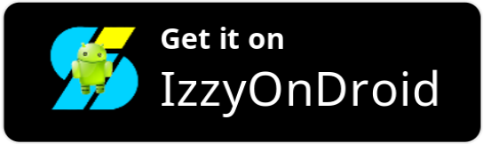

# Lumolight: Screen & Flashlight

[![Product Name Screen Shot][product-screenshot]](https://play.google.com/store/apps/details?id=com.bitmavrick.lumolight)

## Get it from

## Introducing Lumolight,

Lumolight is an open-source flashlight app that can perform both front and back flash. The app is designed based on the "Material You" design system and it looks stunning. The app supports both light and dark themes and supports dynamic theming.

It uses the screen as a front flash by brightening up and showing some static colors that the user chooses and it uses the flashlight for the torch mode. It has "Tile support" where you can use the front flash without even opening the app, and also adjust the brightness using the volume keys

The customization option is one of the strong parts of this app. For the front flash, you can choose:

Colors: Which color do you want to light up
Duration: For how long it will be active.
Brightness: The level of brightness you want.

For the back flash:
Duration: For how long it will be active.
BPM (Blink per minute): You can blink your flashlight and also adjust its value.
Flash-strength: You can also adjust the flashlight's strength. (Supported devices only)

We are constantly improving our app by adding exciting features and fixing any issues that arise. With this app, you can be sure it will bring a good user experience.

## Screenshots

| ![ss-1] | ![ss-2] | ![ss-3] |
| ------- | ------- | ------- |
| ![ss-4] | ![ss-5] | ![ss-6] |
| ![ss-7] | ![ss-8] | ![ss-9] |

[product-screenshot]: images/banner1.png
[ss-1]: images/1.png
[ss-2]: images/2.png
[ss-3]: images/3.png
[ss-4]: images/4.png
[ss-5]: images/5.png
[ss-6]: images/6.png
[ss-7]: images/7.png
[ss-8]: images/8.png
[ss-9]: images/9.png
